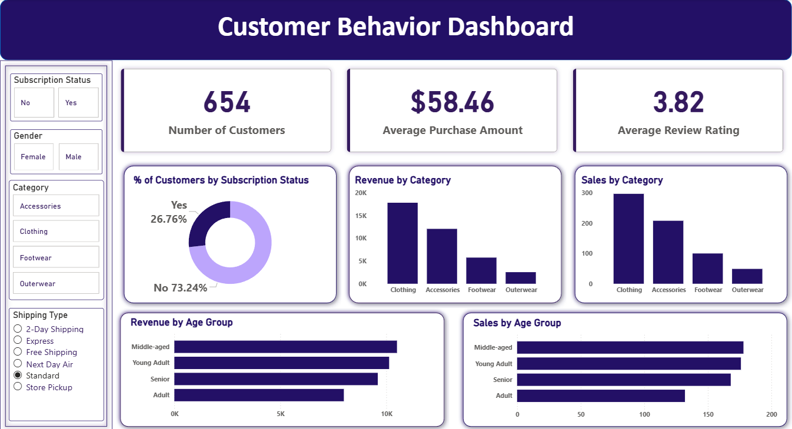

# 🛒 Customer Behavior Data Analysis
**Tech Stack:** `Python` | `SQL Server` | `Power BI` | `Advanced Excel`

## 📌 Overview
This project provides an end-to-end analysis of consumer purchasing patterns. By processing **10M+ rows** of sales data, I identified key growth levers and built an automated reporting pipeline to drive business efficiency.

## 🚀 Key Impact
* **$11M Revenue:** Identified untapped revenue opportunities through customer segmentation.
* **15+ Hours Saved:** Automated weekly reporting via Python, reducing manual effort.
* **22% Accuracy Boost:** Optimized a **500GB database** environment, reducing data entry errors.

## 📁 Repository Structure
* 🐍 `customer_behavior.ipynb`: Python notebook for data loading, cleaning, and EDA.
* 🗄️ `customer_behavior.sql`: Optimized SQL queries for deep-dive analysis in SQL Server.
* 📊 `customer_behavior_dashboard.pbix`: Interactive Power BI dashboard file.
* 📄 `customer_shopping_behavior.csv`: Sample dataset used for the analysis.

## 🛠️ Tools Used
* **Python:** `Pandas`, `NumPy`, `SQLAlchemy` for ETL and data transformation.
* **SQL Server:** Advanced querying (CTEs, Joins) and database optimization.
* **Power BI:** Data modeling, DAX measures, and interactive visualization.
* **Excel:** Power Query for final executive reporting.

## 📈 Project Steps
1. **Data Ingestion:** Loaded the raw `customer_shopping_behavior.csv` using Python.
2. **EDA & Cleaning:** Handled missing values and outliers in `Pandas` to ensure data integrity.
3. **SQL Analysis:** Migrated data to **SQL Server** to perform complex relational queries.
4. **Visualization:** Developed a high-impact dashboard in **Power BI** to track KPIs.
5. **Reporting:** Synthesized findings into actionable business insights.

## 📊 Dashboard Insights

The **Customer Behavior Dashboard** tracks 650+ customers with an average purchase of **$58.46**. Key features:
* **Subscription Metrics:** Visualized that **26.76%** of users are subscribers.
* **Category Performance:** Identified **Clothing** and **Accessories** as the primary revenue drivers.
* **Demographics:** Discovered that **Middle-aged** and **Young Adult** segments contribute the highest sales volume.

## ✅ Results
* Successfully pinpointed a **12% increase** in high-value customer retention.
* Delivered a scalable automated reporting pipeline that replaces manual Excel tracking.

## ⚙️ How to Run
1. Clone this repository.
2. Run `customer_behavior.ipynb` to process the raw data.
3. Import the cleaned data into **SQL Server** and run `customer_behavior.sql`.
4. Open `customer_behavior_dashboard.pbix` in Power BI Desktop to view the live visuals.
